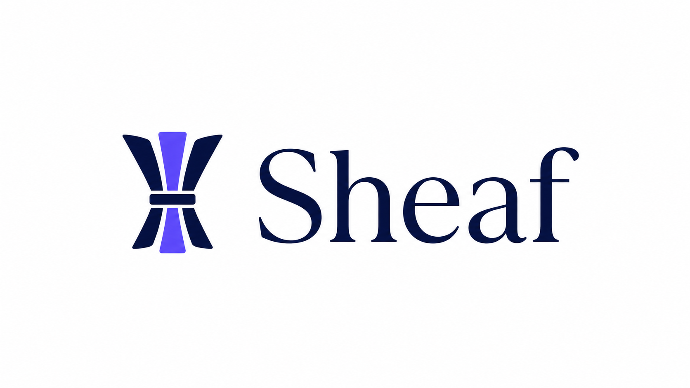

<p align="center">
  <a href="README.md">English</a> | <b>中文</b>
</p>

<p align="center">
  
</p>

<h1 align="center">Sheaf</h1>

<p align="center"><b>选择好来源，把它们变成 Agent 可以核验的知识</b></p>

<p align="center">
  <a href="https://www.python.org/downloads/"></a>
  <a href="LICENSE"></a>
  <a href="https://github.com/zhelunSun/sheaf-ai/actions/workflows/ci.yml"></a>
  <a href="https://pypi.org/project/sheaf-ai/"></a>
</p>

---

**Sheaf**（/ʃiːf/，麦穗束）把你主动选择的技术来源，变成 **AI Agent 真正能用、也能核验的知识库**。你的收藏选择把信息品味传给 Agent；来源溯源则防止系统把“你选择了它”偷换成“它必然正确”。本地优先，开源免费。

> **Sheaf** 是一束收获的谷物。Sheaf 把用户主动选择的来源聚成知识，同时保留知识与证据的联系。

## 快速开始

**1 · 安装（全平台通用）：**

```bash
pip install sheaf-ai
sheaf config setup     # 一次性：选一个提供商，粘贴任意 OpenAI 兼容的 API Key
```

**2 · 接入你的 agent：**

```bash
sheaf setup            # 自动识别 Claude Code / Codex / Cursor / Windsurf / WorkBuddy，
                       # 写入 MCP 配置 + 部署内置 skill / 说明书
```

**3 · 用起来：**

```bash
sheaf collect https://arxiv.org/abs/2401.00000   # 收藏链接
sheaf search "transformer architecture"          # 搜索知识库
sheaf crystallize AI                             # 结晶知识卡片
```

无需 Sheaf 账号或托管存储。语料本地保存 —— 项目目录内为 `./data/`，否则为 `~/.sheaf/data`，格式 Markdown + JSON；模型推理发送到你配置的提供商。可用 `SHEAF_DATA_DIR` 覆盖数据路径。

> **Claude Code 上更快 —— 完全免安装：**
> ```bash
> claude mcp add sheaf -- uvx --from sheaf-ai sheaf-mcp
> ```
> `uvx` 是 npm 风格的运行器（`brew install uv` / `winget install astral-sh.uv`）。随后用 `uvx --from sheaf-ai sheaf config setup` 配置 Key。

## 为什么需要 Sheaf？

收藏的文章、论文、仓库和教程很难直接进入 Agent 工作流。书签能告诉你网页在哪里，
却不能告诉 Agent 哪个来源支持某个结论，也不能解释这个结论后来为什么改变。

Sheaf 解决这个问题。每条链接都变成一个**结构化条目**。积累足够多后，结晶为**知识卡片** — 可携带、可搜索、Agent 可消费。

## 核心功能

| | 它做什么 |
|---|---|
| 🌾 **收藏——基础能力** | 粘贴链接或笔记，完成抓取、清洗、分类并保留来源。 |
| 🔎 **检索——核心路径** | 关键词检索已经稳定；实验性混合路径加入卡片转接的语义信号，直接 Entry 索引仍在补齐。 |
| ✨ **结晶——核心路径** | 把多条收藏变成来源可解析的知识卡片。 |
| 🧭 **增量演化——核心路径** | 用受约束的 create/update/merge/contest/resolve/retire 转移维护知识，并保留不可变历史；证据强度是可解释的序数启发式，不是概率。 |
| 🤖 **Agent 就绪** | 内置 MCP 服务器 —— 任何 agent 都能搜索、引用、推理你的知识库。 |
| 🔒 **本地优先** | 知识文件保存在本地，无 Sheaf 账号和遥测；模型处理步骤使用你配置的提供商。 |

### 结晶 —— 把精选来源变成可复用主张

结晶是 Sheaf 三条核心算法路径之一。`sheaf crystallize` 不把来源留作彼此孤立的
书签，而是形成可以复用、仍与来源相连的结论：

```
$ sheaf crystallize AI
✨ 5 张知识卡片已结晶:
  📌 RAG 面临检索相关性挑战 (90%)
     RAG 系统高度依赖检索质量；错误会降低输出可靠性。
  📌 CRAG 框架提升 RAG 鲁棒性 (95%)
     CRAG 引入检索评估器、网页搜索增强和文档分解。
```

每张 batch 卡片含 **证据溯源**（哪些来源贡献了它）、**主题归属**、**标签**。用 `sheaf crystallize --semantic "查询"` 跨所有卡片做向量语义搜索。

实验性的证据治理路径更严格：source ID 必须对应真实已收藏 Entry；冲突先进入 `contested` 状态；旧版本和决策原因写入事件账本；解决冲突必须提供明确的 resolution basis。它不宣称 LLM 决策策略或置信概率已经校准：

```bash
sheaf memory apply --request transition.json
sheaf memory snapshot --topic "Agent memory"
sheaf memory history --topic "Agent memory"
```

已实现能力与拟议能力的边界见[产品与评测提案](docs/EVIDENCE-GOVERNED-MEMORY-PROPOSAL.md)及冻结的 [G0-G3 协议](evals/evidence-governed-memory/PROTOCOL.md)。
可用 `python evals/evidence-governed-memory/run_executor_acceptance.py` 独立复现
确定性执行器验收；它验证来源约束、幂等、冲突保留、官方更正与审计历史，但不冒充
LLM 策略质量 benchmark。

[架构与评测约定](docs/ARCHITECTURE-AND-EVALUATION.md)进一步明确了三条核心算法路径、
当前成熟度、无需真实用户的测试阶梯，以及比较性结论仍需完成的实验。

## 接入你的 Agent

`sheaf setup` 为每个工具写入正确格式的 MCP 配置，并部署内置 skill / 说明书，让 agent 知道如何使用 Sheaf：

```bash
sheaf setup --target claude          # ~/.claude.json + ~/.claude/skills/sheaf-guide.md
sheaf setup --target codex           # ~/.codex/config.toml + ~/.codex/AGENTS.sheaf.md
sheaf setup --target cursor          # .cursor/mcp.json（另有 windsurf、workbuddy）
sheaf setup                          # 自动检测当前环境 + 已安装的 agent
sheaf setup --target codex --dry-run # 预览但不写入
```

> **MCP 与 skill 一体安装。** `sheaf setup` 一次部署 MCP 服务器 **和** skill —— skill 告诉 agent *何时* 主动捕获笔记、何时从知识库召回,所以它不是可有可无的装饰。优先用它,而非裸 `uvx` 一行(那只接 MCP、不带 skill)。要一次全搞定(key + MCP + skill + 健康检查)用 `sheaf init --auto`。

MCP 服务器默认暴露 **4 个核心工具** —— `sheaf_collect`、`sheaf_search`、`sheaf_crystallize`、`sheaf_get_card` —— 刻意保持默认上下文精简。其余 10 个（含 3 个 evidence-memory 工具）仍可通过 CLI 或显式 MCP `tools/call` 调用；设 `SHEAF_MCP_TOOLS=all` 可暴露全部 14 个。完整工具矩阵与设计理由见 [Issue #91](https://github.com/zhelunSun/sheaf-ai/issues/91)，接入细节见 [docs/mcp-setup.md](docs/mcp-setup.md)。

Agent 还可经 **MCP Resources** 只读**浏览**知识库 —— `sheaf://entries/recent`、`sheaf://entries/{id}`、`sheaf://stats`、`sheaf://tags`（`resources/list` / `resources/read`）。规范见 [docs/agent-query-spec.md](docs/agent-query-spec.md)。

## 命令一览

```bash
sheaf help                       # 分组命令总览
sheaf collect <url> | --text "…" # 收藏链接，或保存笔记（标记为 note）
sheaf search <query>             # 全文搜索（结果显示 entry id）
sheaf list [--page N]            # 浏览条目，分页
sheaf get <id>                   # 查看一条条目完整详情
sheaf crystallize <topic>        # 从主题结晶知识卡片
sheaf memory apply --request FILE # 应用经过校验的证据转移
sheaf memory snapshot            # 查看 active / contested 状态
sheaf memory history             # 审计不可变转移历史
sheaf stats | tags | weekly | insights | urgent
sheaf mcp                        # 启动 MCP 服务器（stdio）
```

每个命令的参数见 `sheaf <命令> --help`。

<details>
<summary><b>Agent 友好：语义化退出码</b></summary>

Sheaf 返回带类型的退出码，让 Agent 可按错误类型编程式分支处理，无需解析 stderr：

| 码 | 名称 | 含义 |
|----|------|------|
| 0 | `SUCCESS` | 操作成功完成 |
| 1 | `PARTIAL` | 部分成功（如批量操作有跳过） |
| 2 | `DUPLICATE` | 条目已存在（去重跳过） |
| 3 | `QUALITY` | 内容质量门禁未通过 |
| 4 | `NETWORK` | 网络连接或 API 调用失败 |
| 5 | `CONFIG` | API key 缺失、URL 无效或配置错误 |
| 6 | `LLM` | LLM API 失败（限流、响应异常） |
| 7 | `STORAGE` | 文件 I/O 或存储故障 |

`--json` 模式下，错误负载含 `exit_code`、`exit_code_name`、`error_type`、`hint` 字段，便于程序化内省。
</details>

## 隐私 & 本地优先

**你的持久化语料留在本机；推理去向由你选择的模型提供商决定。**

- 所有内容本地存储 —— 项目目录内为 `./data/`，否则为 `~/.sheaf/data`（可用 `SHEAF_DATA_DIR` 覆盖）
- LLM 调用发送到**你选择的** API 提供商 —— 不经 Sheaf 中转
- 无遥测、无分析、无账号
- Markdown + JSONL 格式 — 完全可迁移，零锁定

## 配置

推荐用 `sheaf config setup` —— 交互式、OS 无关，Key 安全存入 `~/.sheaf/config.json`。支持任何 OpenAI 兼容端点：

| 提供商 | Key 环境变量 | 默认模型 |
|---|---|---|
| OpenAI | `OPENAI_API_KEY` | `gpt-4o` |
| DeepSeek | `DEEPSEEK_API_KEY` | `deepseek-chat` |
| SiliconFlow | `SILICONFLOW_API_KEY` | `deepseek-ai/DeepSeek-V3.2` |
| Together AI | `TOGETHER_API_KEY` | `meta-llama/Llama-3.3-70B-Instruct-Turbo` |
| Groq | `GROQ_API_KEY` | `llama-3.3-70b-versatile` |

```bash
sheaf config use deepseek        # 切换默认提供商
sheaf config list                # 查看已配置的提供商
```

<details>
<summary><b>高级：环境变量 / <code>.env</code>（CI 或临时使用）</b></summary>

Sheaf 会自动读取工作目录下的 `.env` 文件（见 [.env.example](.env.example)）。也可在 shell 中设置 —— 唯一的 OS 差异只是语法：

```bash
# macOS / Linux
export OPENAI_API_KEY=sk-...
# Windows PowerShell:   $env:OPENAI_API_KEY="sk-..."
# Windows CMD:          set OPENAI_API_KEY=sk-...
export OPENAI_BASE_URL=https://api.openai.com/v1   # 可选 —— 非 OpenAI 端点用
```
</details>

## 架构

```
来源 → 收藏与规范化 → Entry → 检索 → Agent
                         ↓
                  来源集合 → 结晶 → KnowledgeCard
                         ↓
新证据 → 受约束状态转移 → 事件账本 → 当前卡片版本
```

| 模块 | 职责 |
|---|---|
| `sheaf_ai/` | 核心 — 管道、存储、搜索、CLI、MCP 服务器、结晶引擎 |
| `sheaf_cards/` | 知识卡片引擎 — 基础类型、向量嵌入、生成 |
| `prompts/` | LLM 提示模板（分类、摘要、结晶） |
| `data/` | 本地知识库（JSONL + Markdown，已 gitignore） |

应用层、领域层、基础设施边界和分阶段开发计划见
[架构与评测约定](docs/ARCHITECTURE-AND-EVALUATION.md)。

## 系统要求

- **Python 3.10+**
- 一个 OpenAI 兼容的 API Key
- Playwright Chromium *（可选，用于 JS 重度网站）*：`pip install -e ".[browser]" && playwright install chromium`

## 开发

```bash
git clone https://github.com/zhelunSun/sheaf-ai.git && cd sheaf-ai
python -m pip install -e ".[dev]"
python -m pytest tests/ -q
python evals/core-algorithms/run_offline_eval.py --compact
python -m ruff check sheaf_ai/ tests/ sheaf_cards/
```

依赖通过 extras 管理：`.[dev]` 本地开发、`.[server]` HTTP API、`.[browser]` Playwright 抓取。

## 当前状态 & 浏览器扩展

Sheaf 处于早期 Alpha，本地收藏到 Agent 的闭环已经可用并由 CI 覆盖。当前研发阶段是
[**核心算法证据**](docs/NEXT-PHASE-PLAN.md)：让真实检索路径与评测一致，建设有标注的离线数据，验证结晶的
证据支持，并运行冻结的 G0-G3 增量演化实验。在结果进入仓库以前，比较性效果仍是
假设而不是产品结论。

Chrome 扩展（`extension/`）提供任意网页的一键收藏与搜索：用 `sheaf serve` 启动本地 API，在 Chrome → 管理扩展 → 开发者模式中加载 `extension/`，然后 `Alt+Shift+S` 或右键任意页面 → "🌾 Collect with Sheaf"。

**试试看**：收藏 20+ 条链接，运行 `sheaf crystallize <主题>`，然后让你的 Agent 来查询。如果对你有用，欢迎开 Issue 或 Discussion 告诉我们你的想法。

> ⭐ 如果 Sheaf 帮到了你，在 [GitHub](https://github.com/zhelunSun/sheaf-ai) 点个 Star 能帮更多人发现它。

## 许可证

[Apache 2.0](LICENSE)

---

<p align="center">
  <b>Sheaf</b> — 一束收获的麦穗，农人带到集市的基本单位。<br>
  数学中，<a href="https://en.wikipedia.org/wiki/Sheaf_(mathematics)">Sheaf</a> 将局部数据粘合为全局图景。<br>
  Sheaf 这个工具做的是同样的事：把精选来源聚拢成束，让你的 Agent 能够找回、核验和复用。
</p>
